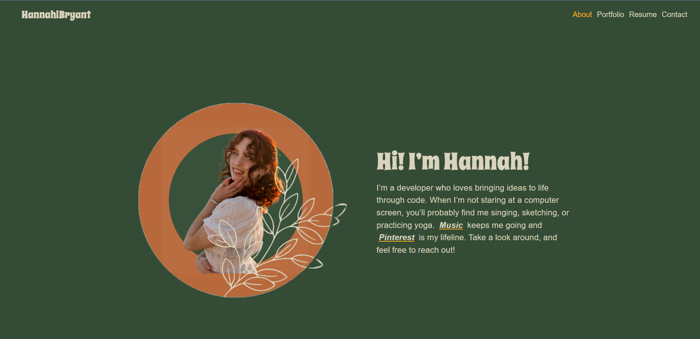

# React Portfolio
  

  ## Description 
Welcome to my React Portfolio! This app showcases my journey and growth in React development. It not only highlights my technical skills but also gives a peek into who I am and what I can bring to the table.

 ## Table of Contents 
- [Installation](#installation) 
- [Usage](#usage)
- [License](#license)
- [Contributing](#contributing)
- [Live Link](#live-link)
- [Questions](#questions)
- [Credits](#credits)
  
## Installation 
If you want to run it locally, here’s what you need to do:
1. Clone or download the repo.
2. Install the required dependencies with ``npm install``
3. Run ``npm run develop`` to start it
4. That’s it! Your app is ready to go — explore and enjoy!

## Usage 
Once the app is up and running — whether locally or through the live link — navigate through the tabs to dive into different sections. Explore my skills, projects, and more!

## License
This project is licensed under the MIT license.

[Learn more about this license](https://opensource.org/licenses/MIT)

  ## Contributing
  Contributions are always welcome! If you have suggestions or improvements, feel free to reach out. Let’s make this project even better. Just email me with your contact details and GitHub username, and let’s chat!

  ## Live Link
  Check out the deployed portfolio and experience it live:
  [Explore my portfolio here!](https://hannahlbryant.netlify.app/) 

  ## Questions
  If you have any questions, feel free to contact me at [hannahbry05@gmail.com](mailto:hannahbry05@gmail.com).
  
  You can also explore more of my work on GitHub here: [hanhasbeenbanned](https://github.com/hanhasbeenbanned).

  ## Credits 
  A huge shoutout to my class TA, Grok, and my instructors for their support in bringing this portfolio to life!
  